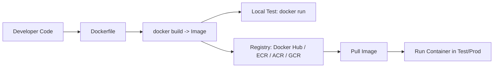

# 📦 Docker Fundamentals & Practical Usage

> **Purpose:** Beginner → Intermediate Docker knowledge for developers, data scientists, and MLOps engineers  
> **Format:** Theory + Hands-on Practical Examples  
> **Source:** Combined notes based on Nitish's Docker tutorial

---

## 📑 Table of Contents

1. [Introduction](#1-introduction)  
2. [What is Docker?](#2-what-is-docker)  
3. [Why Use Docker?](#3-why-use-docker)  
4. [Docker Architecture](#4-docker-architecture)  
5. [Docker Images](#5-docker-images)  
6. [Dockerfile – The Image Blueprint](#6-dockerfile--the-image-blueprint)  
7. [Docker Containers](#7-docker-containers)  
8. [Docker Registry](#8-docker-registry)  
9. [Docker Workflow](#9-docker-workflow)  
10. [Common Use Cases](#10-common-use-cases)  
11. [Practical Setup](#11-practical-setup)  
12. [Practical Demonstrations](#12-practical-demonstrations)  
13. [Key Insights](#13-key-insights)  
14. [Keywords](#14-keywords)  
15. [FAQ / Quick Revision](#15-faq--quick-revision)  
16. [Diagrams](#16-diagrams)  
17. [Useful Snippets](#17-useful-snippets)  

---

## 🏁 1. Introduction

Docker is a core tool for modern engineering — whether you are a **software developer, web developer, ML engineer, or DevOps professional**.

This guide covers:
- **Core Theory:** Docker engine, images, containers, registry, Dockerfile, architecture.
- **Hands-on Practical:** Running containers, building images, pushing/pulling from Docker Hub, containerizing a real ML project.

🎯 **Goal:** Take you from **beginner to intermediate**, enabling you to confidently containerize and deploy applications.

---

## 🧐 2. What is Docker?

Docker is a **platform** to build, share, and run applications inside **containers**.

- **Analogy:** Docker containers are like **Maggi masala packets** → ensure **same taste everywhere**.  
  Similarly, Docker ensures **same environment everywhere** (dev, test, prod).

- **Problems solved:**  
  - “Works on my machine” issues  
  - OS/library/configuration mismatches  
  - Reproducibility issues in ML or production

---

## 💡 3. Why Use Docker?

### ✅ Consistency Across Environments
- Packages app + dependencies together  
- Guarantees identical behavior everywhere  
- Saves debugging time & reduces deployment bugs  

### 🔒 Isolation
- Multiple apps can run on same host without conflict  
- Lightweight compared to VMs (no full OS per app)  
- Improves security & avoids dependency clashes  

### 📈 Scalability
- Spin up multiple containers quickly  
- Load-based scaling (start/stop containers dynamically)  
- Efficient resource usage  

---

## ⚙️ 4. Docker Architecture

Docker follows a **client–server architecture**:

- **Docker Engine:** Core service
  - **Docker Daemon:** Builds/runs containers (background process)
  - **REST API:** Programmatic access to daemon
  - **Docker CLI:** Command-line interface for interaction

- **Images:** Templates for containers  
- **Containers:** Running instances of images  

---

## 🖼️ 5. Docker Images

**Definition:** Lightweight, standalone packages with:
- App code
- Runtime
- Libraries
- Environment variables & configs

**Lifecycle:**
1. **Build:** `docker build` using Dockerfile  
2. **Store:** Local cache or registry  
3. **Distribute:** Push to registry  
4. **Run:** Create containers

---

## 📜 6. Dockerfile – The Image Blueprint

A **plain text file** with build instructions for creating an image.  
Each instruction creates a new **layer** (for caching & faster rebuilds).

**Example:**
```dockerfile
FROM python:3.9
WORKDIR /app
COPY . /app
RUN pip install -r requirements.txt
EXPOSE 5000
CMD ["python", "app.py"]
```

---

## 📦 7. Docker Containers

- **Running instance** of an image  
- Portable, lightweight, isolated  

**Analogy:**  
Image = DVD  
Container = Playing the DVD on a device → you can run multiple containers from the same image.

---

## 🏛️ 8. Docker Registry

- **Registry:** Storage & distribution hub for images  
- **Most popular:** Docker Hub  
- **Others:** AWS ECR, GCP Artifact Registry, Azure Container Registry  

Concepts:
- **Repository:** Collection of images (different versions)  
- **Tags:** Version labels (e.g., `v1`, `latest`)

---

## 🔄 9. Docker Workflow

1. Write code + Dockerfile  
2. Build image → `docker build -t myimage .`  
3. Test locally → `docker run`  
4. Push to registry → `docker push myimage`  
5. Others pull & run → `docker pull myimage`

Ensures **consistent environments** from development → QA → production.

---

## 🌍 10. Common Use Cases

- Microservices architecture  
- CI/CD pipelines  
- Cloud migration  
- Scalable web applications  
- Testing & QA  
- Machine learning deployment (reproducibility)  
- API development & hosting  

---

## 🖥️ 11. Practical Setup

**Tools Used:**
- **Docker Desktop:** GUI + Docker Engine + CLI  
- **Docker Hub:** Image registry (push/pull images)

**Verify Installation:**
```bash
docker --version
docker pull hello-world
docker run hello-world
```

---

## 🛠️ 12. Practical Demonstrations

### Example 1: Hello World Container
- Pull image → run → prints confirmation message → exits.

### Example 2: Flask App Containerization
```bash
docker build -t flask-app .
docker run -p 888:5000 flask-app
```
Open browser → `http://localhost:888`

### Example 3: ML Project Containerization (Streamlit)
- Clone repo → add Dockerfile → build → run with `-p 8501:8501`  
- Fix version issues (e.g., downgrade base image to Python 3.7 if needed)  
- Streamlit app runs consistently across machines

### Example 4: Push to Docker Hub
```bash
docker login
docker tag myimage username/myimage:latest
docker push username/myimage:latest
```
Then test by pulling & running on a clean machine.

---

## 🔑 13. Key Insights

- **Consistency:** No more “works on my machine”  
- **Isolation:** Secure, independent execution  
- **Scalability:** Spin up multiple containers easily  
- **Port Mapping:** `-p host:container` needed for external access  
- **Version Control:** Tags make rollback & upgrades simple  

---

## 📝 14. Keywords

`Docker`, `Containerization`, `Docker Engine`, `Docker Daemon`, `Docker CLI`, `REST API`,  
`Dockerfile`, `Image`, `Container`, `Registry`, `Docker Hub`, `Port Mapping`,  
`Microservices`, `CI/CD`, `Streamlit`, `Flask`, `Machine Learning Deployment`

---

## ❓ 15. FAQ / Quick Revision

**Q:** Difference between Image & Container?  
**A:** Image = Template, Container = Running instance  

**Q:** Why use Docker over sharing code?  
**A:** Ensures reproducibility & eliminates environment mismatch  

**Q:** What is Port Mapping?  
**A:** Connects container port to host port (`-p host:container`)  

**Q:** Can Docker run on Windows?  
**A:** Yes, via Docker Desktop

---

## 🖼️ 16. Diagrams

### Mermaid: Docker Workflow


---

## 🧩 17. Useful Snippets

### `.dockerignore` (recommended)
```
.git
__pycache__/
*.pyc
*.pyo
*.pyd
.env
venv/
build/
dist/
*.log
.idea/
.vscode/
.DS_Store
```

### Basic Commands Cheat Sheet
```bash
# Images & Containers
docker images
docker ps -a
docker pull <image>
docker run -it --name myctr -p 8080:80 <image>
docker stop myctr && docker rm myctr
docker rmi <image>

# Build & Tag
docker build -t username/myapp:1.0 .
docker tag username/myapp:1.0 username/myapp:latest

# Push/Pull
docker login
docker push username/myapp:1.0
docker pull username/myapp:1.0

# Exec into a running container
docker exec -it myctr /bin/bash
```

---

✅ **Conclusion:**  
Docker enables **reproducible, scalable, and consistent software deployment**.  
Mastering Docker’s workflow — images, containers, Dockerfiles, registries — is essential for every modern developer and data scientist.
